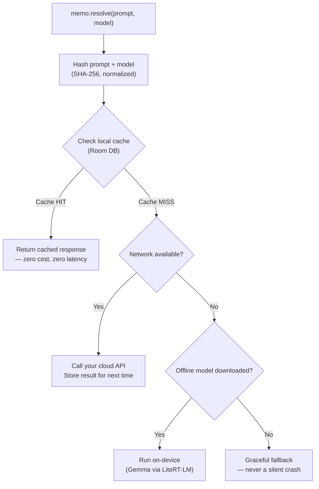

<div align="center">


# Memo

A caching and execution layer that sits between your app and any LLM API — saving cost, surviving network loss, and giving developers full control.

[](https://jitpack.io/#Majid460/memo-cache-android)
[](https://kotlinlang.org)
[](https://developer.android.com)
[](#license)
[](#how-it-works)

</div>

---

## Table of Contents

- [Why Memo Exists](#why-memo-exists)
- [See It In Action](#see-it-in-action)
- [How It Works](#how-it-works)
- [Features](#features)
- [Installation](#installation)
- [Quick Start](#quick-start)
- [Configuration](#configuration)
  - [Model Sources](#model-sources)
  - [Hardware-Aware Tiered Models](#hardware-aware-tiered-models)
  - [Custom Cache Store](#custom-cache-store)
  - [Secrets & API Keys](#secrets--api-keys)
- [API Reference](#api-reference)
- [Architecture](#architecture)
- [The Demo App](#the-demo-app)
- [Running the Project Locally](#running-the-project-locally)
- [Project Structure](#project-structure)
- [Status](#status)
- [FAQ](#faq)
- [Related Projects](#related-projects)
- [License](#license)

---

## Why Memo Exists

Every team integrating an LLM API into their app eventually runs into the same three problems:

1. **Redundant cost.** The same question gets asked repeatedly — by the same user, or different users — and every single one silently re-bills tokens, even when the answer was already known seconds ago.
2. **Fragile UX.** The moment the network drops, most apps simply fail. No fallback, no degraded experience — just a broken screen.
3. **One-size-fits-all models.** A high-end phone and a budget device get shipped the exact same model size, regardless of what each can actually run well.

Memo is a small, focused library that solves all three — as a drop-in layer, not a rewrite of how your app talks to AI.

---

## See It In Action

<table>
<tr>
<td width="33%"></td>
<td width="33%"></td>
<td width="33%"></td>
</tr>
<tr>
<td align="center"><b>Choose your model</b><br/>Pick Lite or Standard on first launch</td>
<td align="center"><b>Go offline anytime</b><br/>Download offline support instantly</td>
<td align="center"><b>Smart rendering</b><br/>Tables, headings, formatting — handled</td>
</tr>
<tr>
<td width="33%"></td>
<td width="33%"></td>
<td width="33%"></td>
</tr>
<tr>
<td align="center"><b>Full control</b><br/>Switch models, monitor resources, anytime</td>
<td align="center"><b>Transparent downloads</b><br/>Live progress, fully visible</td>
<td align="center"><b>Model required status</b><br/>Alerts you when a local model needs loading</td>
</tr>
<tr>
<td width="33%"></td>
<td width="33%"></td>
<td width="33%"></td>
</tr>
<tr>
<td align="center"><b>True offline support</b><br/>Full conversations, zero connectivity</td>
<td></td>
<td></td>
</tr>
</table>

All six screenshots are from the included Compose demo app, included in this repo and runnable out of the box.

---

## How It Works



**Every response tells you exactly where it came from** — cache, cloud, or on-device — via `MemoResponse.source`, so your app and your analytics always know what happened.

The whole decision tree above is handled internally by `Memo.resolve()`. Your app calls one function; Memo handles the routing.

---

## Features

| Feature | Description |
|---|---|
| **Transparent caching** | SHA-256 hashed, TTL-based, Room-persisted. Identical prompts return instantly with zero network cost. |
| **Cost estimation** | Built-in pricing table estimates real dollars saved per cache hit, exposed via `MemoStats`. |
| **True offline fallback** | Runs a real quantized LLM (Gemma, via Google's LiteRT-LM) directly on-device — not a stub, a working model. |
| **Hardware-aware tiers** | Lite and Standard model tiers, selectable by the user or resolved automatically based on device RAM and storage. |
| **Live network observability** | A reactive Kotlin `Flow` built on `ConnectivityManager.NetworkCallback`, exposing real-time state your UI can subscribe to. |
| **Bring your own provider** | Works with any cloud API — OpenAI-compatible, Gemini, Claude, Groq, or a fully custom endpoint. |
| **Full developer control** | Override model URLs, disable auto-download, swap the cache backend, or plug in your own tier-resolution logic. |
| **Pure Kotlin core** | `memo-core` has zero Android dependencies — fully unit tested, portable, KMP-ready. |

---

## Installation

Add JitPack to your project's repositories:

```kotlin
dependencyResolutionManagement {
    repositories {
        maven("https://jitpack.io")
    }
}
```

Add the dependency:

```kotlin
dependencies {
    implementation("com.github.Majid460:memo-cache-android:1.0.0")
}
```

**Requirements:** minSdk 24+, Kotlin 1.9+, AndroidX.

---

## Quick Start

```kotlin
val memo = Memo.Builder(context)
    .autoDownloadModel(true)
    .build()

lifecycleScope.launch {
    memo.resolve(
        prompt = "Summarize this article...",
        model = "your-model-name",
        cloudApiCall = { prompt -> yourApiClient.chat(prompt) }
    ).collect { token ->
        // Tokens stream in — from cache (instant),
        // your cloud API, or the on-device model.
        // No need to know which; Memo handles it.
    }
}
```

Don't forget to release resources when done:

```kotlin
override fun onCleared() {
    super.onCleared()
    memo.close()
}
```

---

## Configuration

### Model Sources

Memo needs to know where to download its offline fallback model from. You have three options, in order of simplicity:

**1. Direct URL — simplest, no backend required:**
```kotlin
val memo = Memo.Builder(context)
    .autoDownloadModel(true, downloadUrl = "https://your-cdn.com/your-model.task")
    .build()
```

**2. Local file you manage yourself:**
```kotlin
val memo = Memo.Builder(context)
    .modelPath("/data/local/tmp/llm/your-model.task")
    .build()
```

**3. Hardware-aware resolver backend** (see below) — automatically picks the right model tier per device.

### Hardware-Aware Tiered Models

For apps that want to serve different model sizes to different devices (e.g., a smaller model on low-RAM phones, a larger one on flagships), point Memo at a resolver backend:

```kotlin
val memo = Memo.Builder(context)
    .modelResolverEndpoint("https://your-backend.vercel.app/api/resolve-model")
    .autoDownloadModel(true)
    .build()
```

Memo's `HardwareProfiler` automatically collects device RAM and available storage, sends them to your endpoint, and downloads whichever model URL comes back.

**A full reference backend** (Vercel + Cloudflare R2) is included in this repo's sibling project, [`memo-backend`](../memo-backend) — complete with deployment instructions. **You are not required to use it.** Point to your own backend, your own static URL, or skip tiering entirely.

Expected request/response contract for a custom resolver:

```json
// POST request body
{ "totalRamMb": 8000, "availableStorageMb": 3000 }

// Expected response
{
  "tier": "STANDARD",
  "downloadUrl": "https://your-cdn.com/your-model.task"
}
```

### Custom Cache Store

By default, Memo persists its cache via Room. To use your own storage backend (e.g., a different database, an in-memory store for testing):

```kotlin
class MyCustomCacheStore : CacheStore {
    override suspend fun get(key: String): CacheEntry? { /* ... */ }
    override suspend fun put(entry: CacheEntry) { /* ... */ }
    override suspend fun evictExpired() { /* ... */ }
    override suspend fun clear() { /* ... */ }
}

val memo = Memo.Builder(context)
    .cacheStore(MyCustomCacheStore())
    .build()
```

### Secrets & API Keys

**Never hardcode URLs or API keys in source code.** Use `local.properties`, which Android Studio gitignores by default in every project:

```properties
# local.properties (never committed)
memo.model.resolver.endpoint=https://your-backend.vercel.app/api/resolve-model
memo.cloud.api.key=your_api_key_here
```

Read these into `BuildConfig` in your app's `build.gradle.kts`:

```kotlin
import java.util.Properties

android {
    defaultConfig {
        val localProps = Properties()
        val localPropsFile = rootProject.file("local.properties")
        if (localPropsFile.exists()) {
            localProps.load(localPropsFile.inputStream())
        }

        buildConfigField(
            "String", "MODEL_RESOLVER_ENDPOINT",
            "\"${localProps.getProperty("memo.model.resolver.endpoint", "")}\""
        )
        buildConfigField(
            "String", "CLOUD_API_KEY",
            "\"${localProps.getProperty("memo.cloud.api.key", "")}\""
        )
    }
    buildFeatures { buildConfig = true }
}
```

Then reference safely in code: `BuildConfig.MODEL_RESOLVER_ENDPOINT`, `BuildConfig.CLOUD_API_KEY`.

---

## API Reference

### `Memo.Builder`

| Method | Description |
|---|---|
| `Memo.Builder(context)` | Start building a `Memo` instance |
| `.autoDownloadModel(enabled, downloadUrl?)` | Enable automatic offline model download, optionally with a direct URL |
| `.modelResolverEndpoint(url)` | Use a hardware-aware backend to resolve the right model tier per device |
| `.modelPath(path)` | Point to a manually-managed local model file |
| `.cacheStore(store)` | Provide a custom `CacheStore` implementation |
| `.build()` | Returns a fully configured `Memo` instance |

### `Memo`

| Member | Description |
|---|---|
| `resolve(prompt, model, cloudApiCall)` | Returns `Flow<String>` — streamed response from cache, cloud, or on-device |
| `networkState` | `StateFlow<MemoNetworkState>` — observe live connectivity/model state |
| `downloadModel()` | Manually trigger a model download |
| `isModelDownloaded` | `Boolean` — whether an offline model is ready to use |
| `close()` | Releases resources (call from `onCleared()` or equivalent lifecycle end) |

### `MemoNetworkState`

```kotlin
sealed class MemoNetworkState {
    object Online
    object OfflineReady
    object OfflineNoModel
    object DownloadingModel
    data class DownloadProgress(val percent: Int)
}
```

### `MemoResponse`

```kotlin
data class MemoResponse(
    val text: String,
    val source: ResponseSource,   // CACHE, NETWORK, or OFFLINE_FALLBACK
    val tokensSaved: Int = 0
)
```

### `MemoStats`

```kotlin
data class MemoStats(
  val totalCalls: Int,
  val cacheHits: Int,
  val networkCalls: Int,
  val offlineFallbacks: Int,
  val totalDollarsSaved: Double
) {
  val cacheHitRate: Double // percentage, 0-100
}
```

Access via `memo.getStats()` on the underlying `MemoCache` (exposed for analytics/debugging purposes).

---

## Architecture

Memo is built as three independent layers:

```
┌─────────────────────────────────────────┐
│              Your App                    │
│         (calls memo.resolve())           │
└────────────────────┬──────────────────────┘
                      │
┌─────────────────────▼──────────────────────┐
│                  Memo                       │
│         (public facade, Builder pattern)    │
├──────────────────────────────────────────────┤
│  MemoStateManager  │  MemoCache  │  OnDevice  │
│  (network + model) │  (caching)  │  Fallback   │
└──────────────────────────────────────────────┘
                      │
        ┌─────────────┴─────────────┐
        │                           │
┌───────▼────────┐         ┌───────▼────────┐
│  memo-core      │         │  memo-android  │
│  (pure Kotlin)  │         │  (Room, LiteRT,│
│  hashing, TTL,  │         │  Network APIs) │
│  cache logic    │         │                │
└─────────────────┘         └────────────────┘
```

`memo-core` is intentionally Android-free — every caching decision (hashing, TTL expiry, cost estimation) is plain, portable Kotlin, fully unit tested in isolation. `memo-android` wires this logic into real Android APIs: Room for persistence, `ConnectivityManager` for network state, and Google's LiteRT-LM for on-device inference.

---

## The Demo App

This repo includes a complete, production-quality Jetpack Compose reference app (`/demo`) demonstrating every feature:

- Real-time streaming chat with both cloud (Groq) and on-device (Gemma) inference
- Live, animated network status indicator with smooth state transitions
- Full Markdown rendering — headings, bold, bullet lists, and horizontally-scrollable tables
- Hardware-aware model tier selection with live storage and CPU monitoring
- Complete download lifecycle: progress, cancellation, and per-tier deletion
- Graceful degradation — a clear, actionable dialog when offline with no model downloaded

This is not a toy example — it's the same app the screenshots above were taken from, and a realistic template for integrating Memo into a real product.

---

## Running the Project Locally

```bash
git clone https://github.com/Majid460/memo-cache-android.git
cd memo-cache-android
```

Add your own secrets to `local.properties` (see [Secrets & API Keys](#secrets--api-keys)):

```properties
memo.model.resolver.endpoint=YOUR_BACKEND_URL
memo.cloud.api.key=YOUR_GROQ_OR_OTHER_API_KEY
```

Open in Android Studio, sync Gradle, and run the `demo` module on a device or emulator (API 24+).

---

## Project Structure

```
memo-cache-android/
├── memo-core/                  Pure Kotlin module
│   └── src/main/kotlin/
│       ├── cache/                CacheEntry, CacheKeyGenerator, CacheStore, MemoCache
│       ├── cost/                 CostEstimator
│       └── stats/                MemoStats, StatsTracker
│
├── memo-android/                Android-specific module
│   └── src/main/kotlin/
│       ├── cache/                Room entities, DAO, RoomCacheStore
│       ├── network/               NetworkObserver, NetworkStatus
│       ├── state/                 MemoNetworkState, MemoStateManager
│       ├── hardware/              HardwareProfiler
│       ├── model/                 ModelFileManager, OnDeviceFallback, ModelResolverApi
│       └── Memo.kt                Public facade
│
├── demo/                        Full Compose reference app
│   └── src/main/
│       ├── assets/llm/             Bundled offline model (optional)
│       └── kotlin/.../ui/chat/     Chat screen, components, ViewModel
│
└── docs/
    ├── assets/                   Logo, branding
    └── screenshots/               README screenshots
```

---

## Status

- [x] Core hashing + TTL caching logic
- [x] Room-backed persistent cache
- [x] Cost estimator + stats tracking
- [x] On-device offline fallback (LiteRT-LM / Gemma)
- [x] Hardware-aware tiered model selection
- [x] Live network observability with auto-fallback
- [x] Model download, cancellation, and per-tier deletion
- [x] Full Compose demo app
- [ ] JitPack publishing (currently build-from-source)
- [ ] Background downloads via WorkManager
- [ ] Kotlin Multiplatform support (Compose Multiplatform)
- [ ] Persisted chat history (planned, not yet implemented)

---

## FAQ

**Does Memo require Cloudflare or Vercel?**
No. Those are used only in the included reference backend (`memo-backend`) for demonstrating hardware-aware model tiers. Memo itself works with any direct URL or no backend at all.

**Does this work with OpenAI / Gemini / Claude?**
Yes — `cloudApiCall` accepts any suspend function that takes a prompt and returns a string. Memo doesn't care which provider you use.

**How large is the on-device model?**
The reference Gemma models used in the demo range from ~690MB (Lite) to ~1GB (Standard). You can supply any LiteRT-LM-compatible `.task` model of your choosing.

**Is the cache encrypted?**
Not by default — `RoomCacheStore` uses standard Room/SQLite storage. If you need encryption, provide a custom `CacheStore` implementation (e.g., backed by SQLCipher).

**What Android versions are supported?**
minSdk 24 (Android 7.0) and above.

---

## Related Projects

- **[memo-backend](../memo-backend)** — Reference Vercel + Cloudflare R2 backend for hardware-aware model resolution. Optional; not required to use Memo.

---

## License

MIT — see [LICENSE](LICENSE) for details.

---

<div align="center">
Built by <a href="https://github.com/Majid460">Majid Shahbaz</a>
</div>