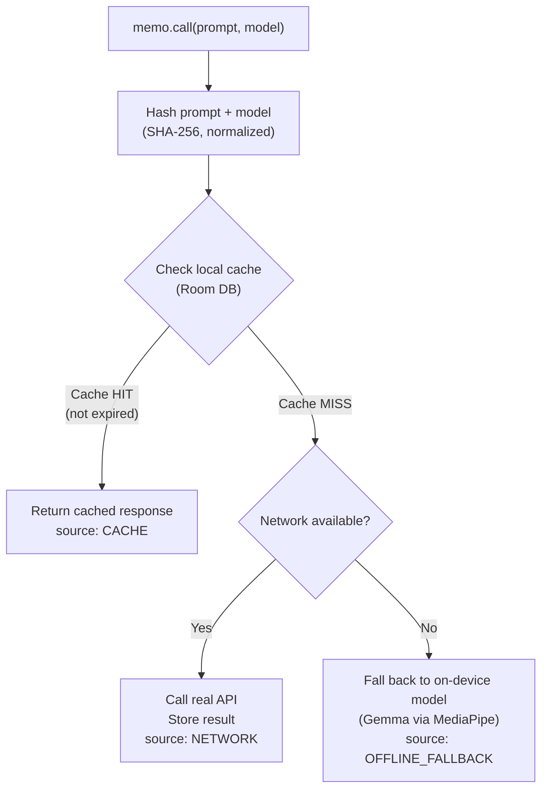

# Memo

**A memoization layer for LLM API calls on Android.**

Apps calling LLM APIs (OpenAI, Gemini, Claude) often repeat identical or near-identical requests — the same question asked twice, the same document summarized by multiple users — and every one of those hits the network and costs money. Memo wraps any LLM API call with a transparent caching layer: identical prompts return instantly from cache instead of hitting the network again, with configurable TTLs and automatic fallback to an on-device model when the cache misses and there's no connection.

---

## The Problem

Every team integrating LLMs into their app eventually hits the same issue: redundant API calls.

- A customer support app where five users ask the same FAQ question — five identical API calls, five times the cost.
- A summarization feature where a user re-opens the same document — the summary gets regenerated from scratch every time.
- A flaky network on mobile — a failed request means no response at all, even if a similar question was already answered minutes ago.

Memo solves this with one wrapper function around your existing API call.

---

## How It Works



Every response returned by Memo tells you exactly where it came from — `CACHE`, `NETWORK`, or `OFFLINE_FALLBACK` — so your app (and your analytics) always know what happened.

---

## Features

- **One-line integration** — wrap any existing API call, no architecture changes required.
- **TTL-based caching** — set how long a cached response stays valid, per call.
- **Prompt normalization** — trims and normalizes prompts so near-identical requests still hit the cache.
- **Offline fallback** — when there's no cached response and no network, falls back to an on-device model (Gemma via MediaPipe) instead of failing outright.
- **Cost tracking** — every cache hit reports estimated tokens (and therefore cost) saved.
- **Pure Kotlin core** — the caching logic has zero Android dependencies, so it's portable to other Kotlin platforms.

---

## Installation

```kotlin
dependencies {
    implementation("com.github.Majid460:memo-cache-android:1.0.0")
}
```

*(via JitPack — add `maven("https://jitpack.io")` to your `repositories` block. Not yet published — see Status below.)*

---

## Usage

```kotlin
val memoCache = MemoCache(store = RoomCacheStore(context))

val response = memoCache.call(
    prompt = "Summarize this article...",
    model = "gpt-4",
    ttlSeconds = 86_400 // cache for 24 hours
) {
    openAiClient.chat(prompt) // your existing API call — only runs on a cache miss
}

println(response.text)
println(response.source) // CACHE, NETWORK, or OFFLINE_FALLBACK
```

---

## Project Structure

```
memo/
├── memo-core/        Pure Kotlin — hashing, TTL logic, cache interface
├── memo-android/     Room-backed cache store, MediaPipe offline fallback
├── demo/             Small Compose app demonstrating cache hits/misses live
└── README.md
```

`memo-core` has no Android dependencies by design — the caching logic (hashing, expiry, the public API) is plain Kotlin, which keeps it testable and portable.

---

## Status

🚧 Actively in development. Current progress:

- [x] Core hashing + TTL logic (`memo-core`)
- [x] Unit tests for cache hit / miss / expiry behavior
- [x] Room-backed persistent cache (`memo-android`)
- [ ] On-device offline fallback via MediaPipe
- [ ] Cost estimator + stats dashboard
- [ ] Demo app
- [ ] JitPack publishing

---

## Why I Built This

Every team shipping LLM features right now is paying for redundant API calls without realizing it. Memo is a small, focused fix — a memoization layer purpose-built for the way mobile apps actually use LLM APIs, with offline resilience built in rather than bolted on.

---

## License

MIT
